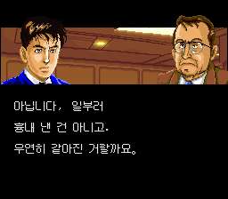
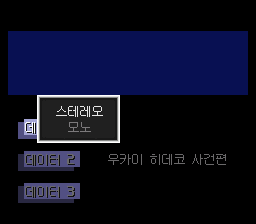
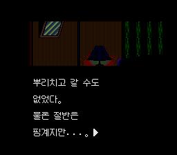

# SFC 과장 시마 고사쿠 슈퍼 비즈니스 어드벤처 한글 패치
테스트가 가능한 버젼이 아니니 아직 하지 마세요.

> **V0.2는 테스트가 많이 부족한 공개 테스트 버전입니다. 전체 대사 검수는 진행 중입니다.** 문맥 오류, 번역 누락, 글자 위치와 그래픽 문제가 남아 있을 수 있습니다. 모든 분기·장시간 저장과 불러오기·여러 에뮬레이터를 검증하지 못했습니다.

《과장 시마 고사쿠 슈퍼 비즈니스 어드벤처》의 비공식 한국어 패치입니다. 대기업 하츠시바 전기산업에서 일하는 시마 고사쿠가 사내 문제와 인간관계를 선택형 어드벤처로 풀어 가는 게임입니다.

이 저장소와 릴리스에는 IPS 패치만 배포하며, 원본 ROM과 패치된 ROM은 포함하지 않습니다.

## 현재 화면

아래 화면은 모두 현재 결과 ROM에서 직접 촬영했습니다.

| 타이틀 | 불러오기 |
|---|---|
|  |  |

| 물음표·느낌표 | 쉼표 |
|---|---|
|  |  |

| 소리 설정 | 보고된 방 장면의 대사 위치 |
|---|---|
|  |  |

## 2026-09-27 수정

- 대사 글꼴에 맞춘 12픽셀 격자, 1픽셀 획의 `?`, `!`, `,` 신규 적용
- 소리 설정창 뒤에 이어하기 글자가 비치던 공유 테두리 타일 수정
- 스테레오·모노 한국어 표시와 소프트 리셋 이후 메뉴 확인
- 번역 공백으로 덮였던 장면 명령 298곳 복원
- 아키코 방 장면과 뉴욕 대사의 잘린 하위 대본 호출 인수 복원
- 1년쯤 전이라는 시간 표현, 아키코의 정중한 답변 등 원문 대조 수정 8항목 반영
- 플레이 중 시작 화면 그래픽이 다시 덮이는 동작 차단 및 불러오기 팝업 복사 범위 제한

타이틀·메뉴·대사·선택지의 한국어화가 포함되어 있으나, 이는 완역 및 전체 검수 완료를 뜻하지 않습니다.

## 패치 방법

1. 아래 SHA-256과 일치하는 헤더 없는 일본판 원본 ROM을 준비합니다.
2. IPS 패처로 `patches/Kachou_Shima_Kousaku_KR_V0.2.ips`를 원본에 적용합니다.
3. 이전 상태 저장에는 화면 메모리가 남을 수 있으므로 새 게임으로 확인합니다. 기존 SRAM은 먼저 백업해 주세요.

| 파일 | 크기 | SHA-256 |
|---|---:|---|
| 일본판 원본 ROM | 1,048,576 bytes | `988eeb2c00dedecbf18f1eb22b5c462b604ac2863a9ead3dc2118c5fefb5d4d7` |
| V0.2 IPS | 240,518 bytes | `03c0eef4a038334d8ec9f460940215a7a5004be92576cf4022b1f6adaf089a37` |
| 패치 결과 ROM | 2,097,152 bytes | `b23c7f4fcf9efc1667bd06d408f2d7f64ed7c0c0dc8b4d4959c2f2ed46716469` |

같은 V0.2 이름의 이전 파일과 구분할 때 위 해시를 확인해 주세요.

## 확인한 범위

- IPS를 원본에 적용한 결과와 현재 ROM이 바이트 단위로 일치
- 체크섬 `0x1D5D`, 보수 `0xE2A2` 확인
- 한글 전진 폭 12픽셀, 반각 공백 6픽셀 및 물리 폰트 셀 충돌 검사
- 최종 번역 필드 4,853개 안의 실제 FE/FD 순서 일치: FE 273개, FD 16개
- 보존한 장면 명령 298곳이 원본 바이트와 일치
- 현재 빌드에서 A/X 메뉴의 콜드 부팅 및 리셋 후 화면 확인
- down3 경로 18,000프레임 내의 보고된 방 장면과 기호 사용 장면 확인
- 아키코 방의 같은 어두운 장면을 일본판과 비교해 그림 영역 일치 확인

바로 전 대본 빌드에서는 네 선택 경로를 각각 90,000프레임 실행했습니다. 현재 빌드와의 차이는 기호 비트맵과 팝업 글자 위치입니다. **실행 완료와 일부 화면 확인을 전체 대사 검수로 간주하지 않습니다.**

현재 대본 경계 의심 항목 159개를 추가 검토 중입니다. 전체 문맥·존댓말·번역 누락·페이지 타이밍, 모든 분기와 장시간 저장·불러오기·리셋 검증이 남아 있습니다. 이전의 100%/잔여 없음 표기는 잘못된 기록으로 정정했습니다.

최신 근거와 한계는 [현재 검증 기록](docs/current_validation.json)에 있습니다. 다른 날짜의 boot/reset 보고서는 이전 빌드의 기록이며 현재 빌드 전체를 보증하지 않습니다.

## 글꼴과 원작

- 대사: x12y12px MaruMinya Hangul 12×12 1bpp
- 일부 숫자·UI: Neo둥근모, 갈무리
- `?`, `!`, `,`: 본 패치용 신규 비트맵
- 원제: 課長 島耕作 スーパービジネスアドベンチャー
- 기종: Super Famicom / 장르: 어드벤처
- 원작 게임과 등장인물·그래픽의 권리는 각 권리자에게 있습니다. 글꼴은 원 배포처의 라이선스를 따릅니다.
