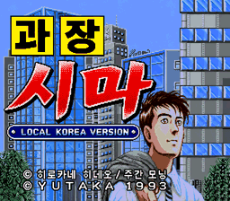
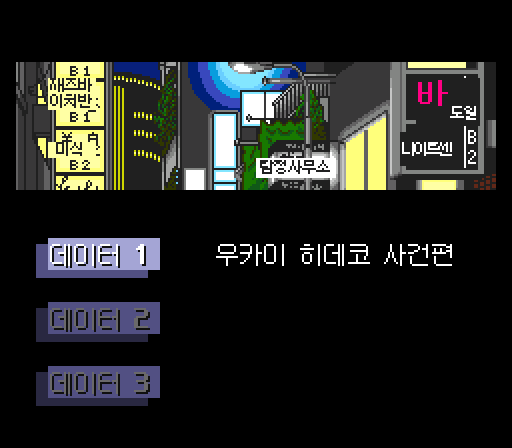
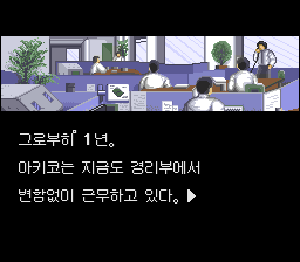

# SFC 과장 시마 고사쿠 슈퍼 비즈니스 어드벤처 한글 패치

> [!WARNING]
> **V0.2는 테스트가 많이 부족한 공개 테스트 버전입니다.** 전체 분기, 모든 세이브 데이터, 장시간 플레이, 실기와 여러 에뮬레이터 조합을 충분히 검증하지 못했습니다. 문맥 오류, 오탈자, 미번역, 드문 화면 깨짐이나 글자 배치 문제가 남아 있을 수 있습니다. 플레이 전 SRAM을 백업해 주세요.

1993년 9월 17일 유타카에서 발매한 슈퍼패미컴용 어드벤처 게임 **《과장 시마 고사쿠 슈퍼 비즈니스 어드벤처》**의 비공식 한국어 패치입니다. 대기업 하츠시바 전기산업에서 일하는 시마 고사쿠가 사내 문제와 인간관계를 풀어 가는 원작 초기 이야기를 선택형 어드벤처로 진행합니다.

이 저장소에는 원본 ROM이나 패치 완료 ROM을 포함하지 않습니다. 사용자가 직접 보유한 일본판 원본 ROM에 IPS 파일을 적용해야 합니다.

## 화면

| 한글 타이틀 | 불러오기 화면 |
|---|---|
|  |  |

## V0.2 적용 범위

- 줌아웃 연출 시작부터 표시되는 한글 타이틀 로고
- 메인 화면, 저작권 표기, 불러오기 UI와 배경 간판
- 기본 대사, 독백, 선택지, 장 제목과 주요 UI의 한국어화
- 한글 물리 폰트 셀 중복 제거: 코/니, 없/사 및 따옴표처럼 보이던 오표시 수정
- 불러오기 배경 간판의 일본어 잔상, 칸 이탈과 바 색상 수정
- 최종 번역 필드 5,157개 반영
- 대본 추출·검수 도구 기준 문맥 및 표기 수정 254건 반영
- 기본 대사 글꼴: x12y12px MaruMinya Hangul 12×12 1bpp
- 반각 공백 6픽셀, 한글 기본 전진 폭 12픽셀
- 숫자 0~9 신규 글리프 적용
- 일본판과 페이지·줄 전환 제어 구조 동일 유지

## 패치 방법

1. 아래 해시와 일치하는 헤더 없는 일본판 원본 ROM을 준비합니다.
2. [Floating IPS](https://www.romhacking.net/utilities/1040/) 또는 Lunar IPS로 `patches/Kachou_Shima_Kousaku_KR_V0.2.ips`를 적용합니다.
3. 기존 상태 저장은 사용하지 말고 게임을 새로 시작합니다. 기존 SRAM은 먼저 백업해 주세요.

### 기준 파일

| 파일 | 크기 | SHA-256 |
|---|---:|---|
| 일본판 원본 ROM | 1,048,576 bytes | `988eeb2c00dedebf18f1eb22b5c462b604ac2863a9ead3dc2118c5fefb5d4d7` |
| V0.2 IPS | 241,531 bytes | `dd75513ccec7690fb0160b833b664ac386f39b1e3b366c3880920c69652e7e3d` |
| 패치 결과 ROM | 2,097,152 bytes | `35291c3762f144fbbd6ef9c163723e8d17de21aaae47da09c20f56933656bade` |

## 검증된 항목

- IPS를 원본 ROM에 적용한 결과와 최종 빌드가 바이트 단위로 일치
- SNES 체크섬 `0x3D33`, 체크섬 보수 `0xC2CC`
- 한글 전진 폭 12픽셀, 반각 공백 6픽셀 검사 통과
- 서로 다른 한글이 같은 물리 폰트 셀을 공유하지 않는지 전수 검사 통과
- 페이지·줄 전환 제어 코드: `FE 273개`, `FD 16개`
- 일본판 대비 제어 코드 위치 불일치 0건, 명령 충돌 0건
- 콜드 부팅과 소프트 리셋 자동 비교에서 프레임 1140까지 표본 39개 일치

검사 자료는 [`docs/page_turn_audit.json`](docs/page_turn_audit.json)과 [`docs/boot_reset_report.json`](docs/boot_reset_report.json)에서 확인할 수 있습니다.

## 테스트가 더 필요한 부분

- 처음부터 엔딩까지의 모든 선택 분기
- DATA 1·2·3의 장시간 저장·불러오기 반복
- 에뮬레이터의 다시 시작과 소프트 리셋 이후 장시간 진행
- 실제 슈퍼패미컴 및 플래시 카트리지
- 드물게 등장하는 인물의 존댓말·반말 관계와 전체 문맥
- 그림 위 대사, 긴 문장, 특수 연출에서의 글자 위치

문제를 발견하면 재현 절차, 사용한 에뮬레이터, 화면 캡처와 함께 Issues에 남겨 주세요. 가능하면 기존 상태 저장이 아닌 새 게임 또는 SRAM 기준으로 확인해 주세요.

## 글꼴

- [x12y12px MaruMinya Hangul - 999 NDS 12x12 1bpp](https://font.emulog.app/#font=font-9c11330b88e241cc)
- [Neo둥근모 한글 2350 16×16 1bpp](https://font.emulog.app/#font=font-45065ee8eedf7051)
- 갈무리7 8×8

각 글꼴의 저작권과 라이선스는 원 배포처의 조건을 따릅니다.

## 원작 게임 정보

- 원제: 課長 島耕作 スーパービジネスアドベンチャー
- 기종: Super Famicom
- 장르: 어드벤처 / 텍스트 어드벤처
- 발매: 1993년 9월 17일
- 발매사: 유타카
- 참고: [super-famicom.jp 게임 정보](https://www.super-famicom.jp/data/ka/ka_0012.html)

## 권리 안내

이 프로젝트는 비공식 팬 한글화 패치입니다. 원작, 게임, 등장인물과 원본 그래픽의 권리는 각 권리자에게 있습니다. 원본 ROM과 패치된 ROM의 업로드·공유 요청은 받지 않습니다.
